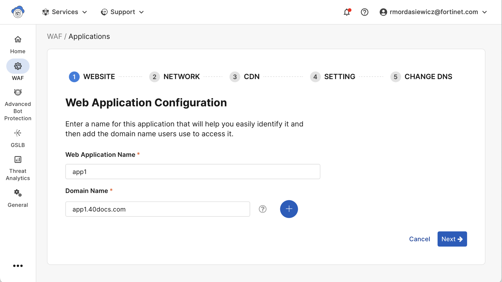
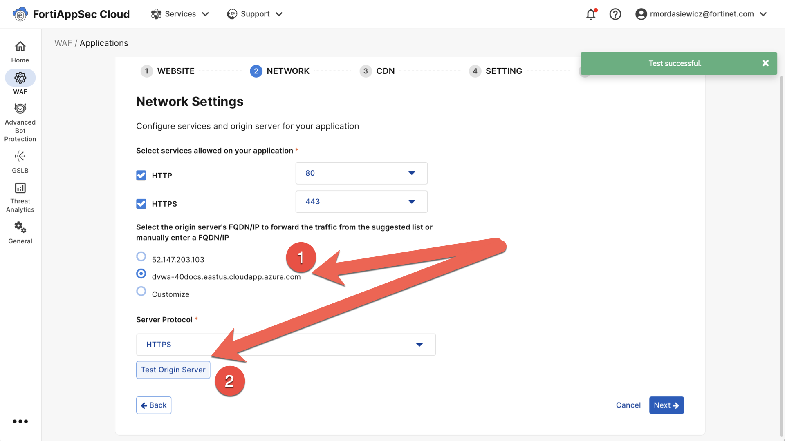
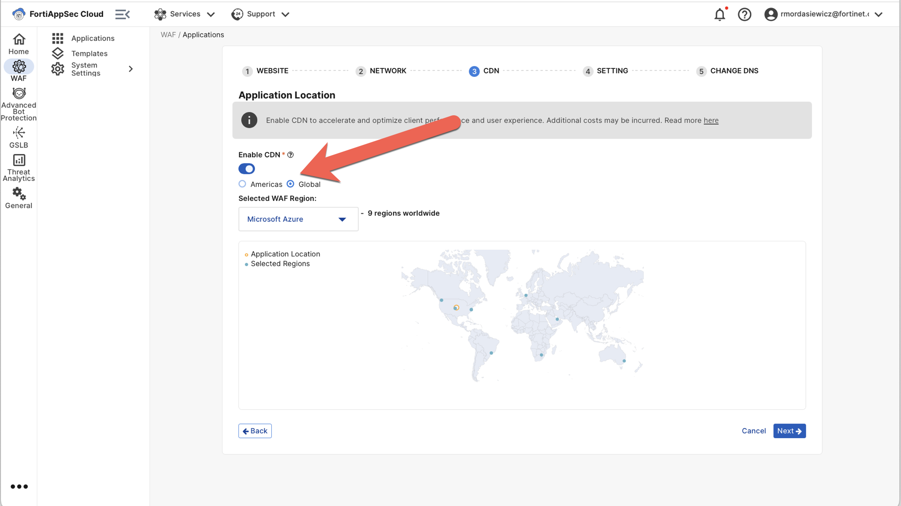
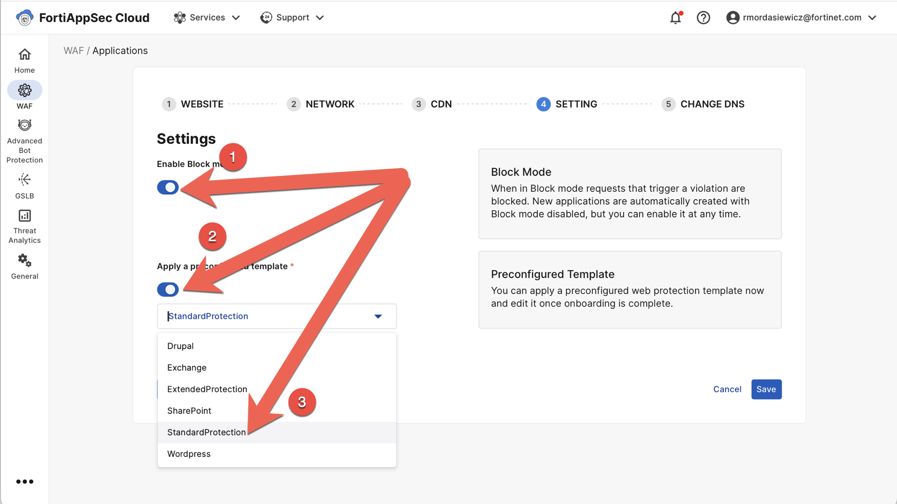

# Add Application

1. Click  -->  --> 

   > 

2. Add your web application name and domain name:

   > 

3. Configure your network settings:

   > 

4. Enable CDN:

   > 

5. Enable block mode and apply a preconfigured template:

   > 
