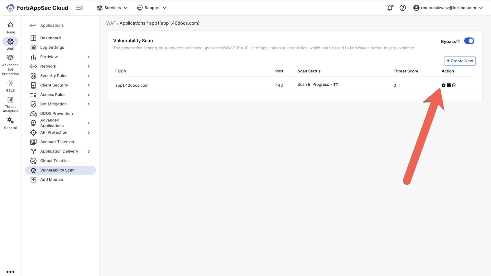
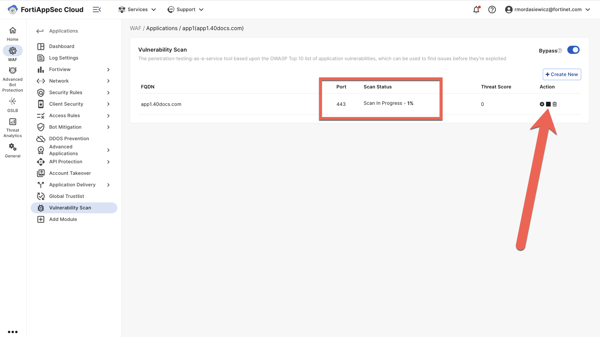

# Vulnerability Scan

1. Navigate to the vulnerability scan menu within your application, toggle bypass, then click create new:

   > 

2. Hit the settings button under the action column:

   > 

3. Navigate to the authentication menu and set your web authentication as per the screenshot:

   > 

4. Note the scan status:

   > 
