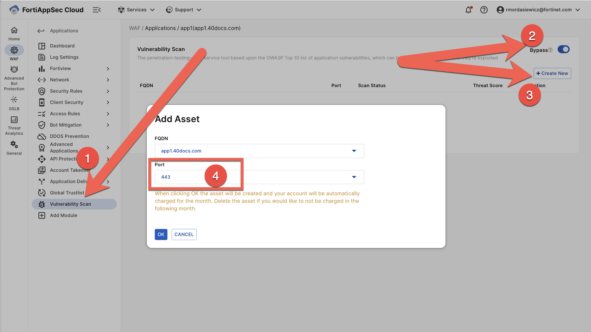

# Vulnerability Scan

1. Navigate to the vulnerability scan menu within your application, toggle bypass, then click create new:

   > 

1. Hit the settings button under the action column:

   > 

1. Navigate to the authentication menu and set your web authentication as per the screenshot:

   > 

1. Note the scan status:

   > 
