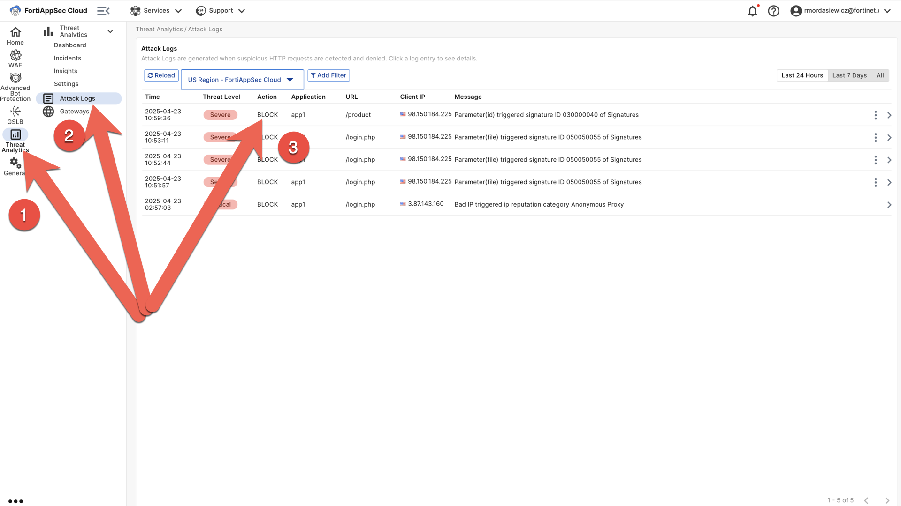

# Attack

1. Simulate an attack by visiting:

    - [https://app1.40docs.com/login.php?file=home;cat%20/etc/passwd](https://app1.40docs.com/login.php?file=home;cat%20/etc/passwd)
    - [https://app1.40docs.com/product?id=1%27%20OR%20%271%27=%271](https://app1.40docs.com/product?id=1%27%20OR%20%271%27=%271)

2. Navigate to the Threat Analytics menu, then click on Attack Logs. You'll see your logs showing the threat level and blocked action for your application:

   > 
